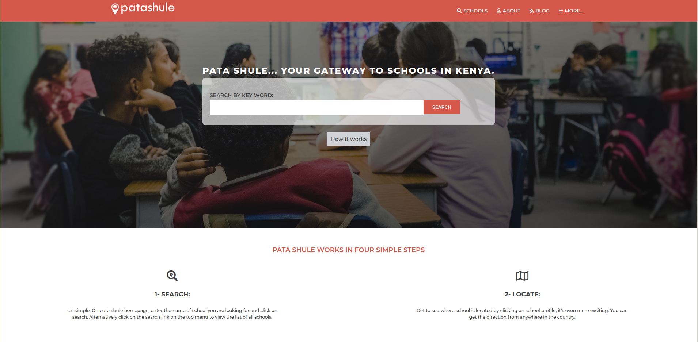

# Patashule capstone

This Project is part of Microverse program built with HTML5, CCS3 and bootstrap.
The website is fully responsive with the help of three media query breakpoints (the default being the smaller viewport), namely: < 768px, >= 768px, >= 1024px, >= 1280px.

## Built With

- HTML5
- CSS3
- Bootstrap

## Live Demo

[Live Demo Link](https://ourandco.github.io/Patashule-Capstone/)

## How To Use 🔧

From your command line, first clone the project:

- `Clone this repository`
- `git clone https://github.com/ourandco/Patashule-Capston.git`
- `Go into the repository`
- `cd Patashule-capstone`
- `git pull`

**Clone the project and feel free to make changes.**

## Author

- Alamgir

👤 **Author**

- GitHub: [@ourandco](https://github.com/ourandco)
- Twitter: [@Alphacrescent1](https://twitter.com/alphacrescent1)

## 🤝 Contributing

Contributions, issues, and feature requests are welcome!

## Show your support

Give a ⭐️ if you like this project!

## Acknowledgments

- Hat tip to Microverse for their `README` template.

## 📝 License

This project is [MIT](https://opensource.org/licenses/MIT) licensed.
